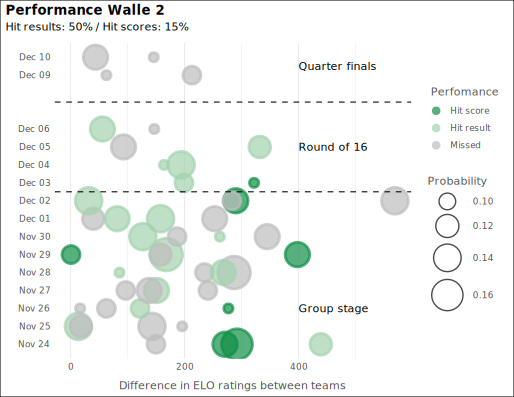

---
title: 'Qatar 2022: match predictor'
author: ''
date: '2022-11-07'
slug: qatar
categories: []
tags: []
---

Every four years, a group of friends organize a World Cup pool (a ["Quiniela"](https://cariquiniela.com/inicio)). The price of winning it is huge. However, for the last four World Cups my performance has been rather pathetic. The reason: I drew my scores based on emotions (In my last *quiniela*, Mexico made it to semis...).

Recently, I visited a friend in Oslo who is an expert in Machine Learning and Deep Generative Models. He's also a big fan of football. Over a couple of beers, quite a few, we decided to unite my data carpentry skills with his statistical knowledge to try to predict Qatar's WC matches. And if possible, become, for the first time, the winners of the "Cari Quiniela".

See all the code in [GitHub](https://github.com/araupontones/CariQuiniela).

# This is what we did

1. We first web-scrapped, from [fbref](https://fbref.com/en/), all the matches that the 32 qualified teams have played since 2011 until just before the WC. 
2. To have a proxy for each team's performance index, we scrapped (via [FIFA Rankings](https://www.fifa.com/fifa-world-ranking/men?dateId=id13792) the tranking of each team for each quarter since 2015.
3. We assumed that, among other things, the number of goals that each team is expected to score during a match, is a function of the number of goals that they have scored in the past, the number of matches that they have failed to score, and the skills of the team that they are playing against. Thus, we created a summary table with these indicators for each team and all years since 2011.
4. During the World Cup, we defined a scheduled job (a cron-job) to update our indicators on daily basis. Thus, our data was always up-to-date.
5. Then, my friend did his predictive magic.

# What was the result?

During the first few games, our performance was very low (we hit only 33% of the win/lose/draw and predicted correctly only 1 score. We assumed that the reason was that the FIFA rankings that we were using were 1) very static in time and 2) were not very accurate to reflect differences between teams. Thus, we substituted FIFA rankings for ELO ratings to have a better indicator for the team's performance. 

**This was our performance of the first 12 matches:**

To have updated data on daily basis, we built a cronjob in our virual machine that ran every day at 1 o'clock. After every match,this cronjob would re-estimate each team's ELO rating and would create the expectancy of a team wining over its opponent based on their ELO ratings differences. We called this variable *magic_johnson*.  This was based on the [eloratings.net](https://www.eloratings.net/about)

The new approach increased our performance from 33% to 50%, which was what our model predicted while we tested. 

**Performace of the model after subsituting FIFA for ELO ratings:**

#What we learnt or confirmed

* Predicting the result of a football match is nearly impossible, there are too many factors that make the game to behave almost randomly. Think about it: 22 players making decisions every second of a match that last 90 minutes....

* For many games, our predictor was very accurate about which team would have more chances to win. However, a serendipitous situation would change the course of things in a second. For example, we predicted that Brasil would bit Croatia 1-0. However, Petkovic's goal in the last minute, made it 1-1, which is a missed score for our system. We had plenty of this situation during the World Cup

* Although we improved our model during the World Cup, we still believe that there is scope for improvement. Our model's most significant variable is the expectancy of a team winning over other team based on their ELO rating differences. However, this variable is what it is called *point-in-time* which shows the differences between the two games right before the match but not how the team's performance has developed over time. Thus, our next attempt will try to include this effect. If we do that rightly, our next model would give a higher change of Morrocco beating Portugal, for example. 

# Some code tips to replicate a similar job

## Avoid GitHub asking for credentials everytime 

It is important to **clone the repo in your virtual machine using "SSH"**. By doing this, you avoid git asking for credentials every time. To do that:

[Cameron McKensie's]("https://www.theserverside.com/blog/Coffee-Talk-Java-News-Stories-and-Opinions/GitHub-SSH-Key-Setup-Config-Ubuntu-Linux"") tutorial was very useful for this.

* In your terminal, check that you don't have any ssh keys installed yet in /user/.ssh/
* If there are none ssh keys, generate one
* `ssh-keygen -o -t rsa -C "mail@myemail.com"`
* It will create a .pub and private key in /user/.ssh/
* Open .pub with notes and paste it in your ssh keys in Settings  >SSh and GPG keys  
* Copy these keys in your virtual machine under /root/.ssh 
* Now clone the repo to your virtual matchine 

## Create a schedule task using crontab

[This tutorial](https://phoenixnap.com/kb/set-up-cron-job-linux) and this [Wiki Article](https://en.wikipedia.org/wiki/Cron) describe the step by step to schedule a job in your virtual machine

* Basically, on your terminal, open the crontab editor `crontab -e`
* And define the command to be run: `* * * * * /your_directory/your_command`

